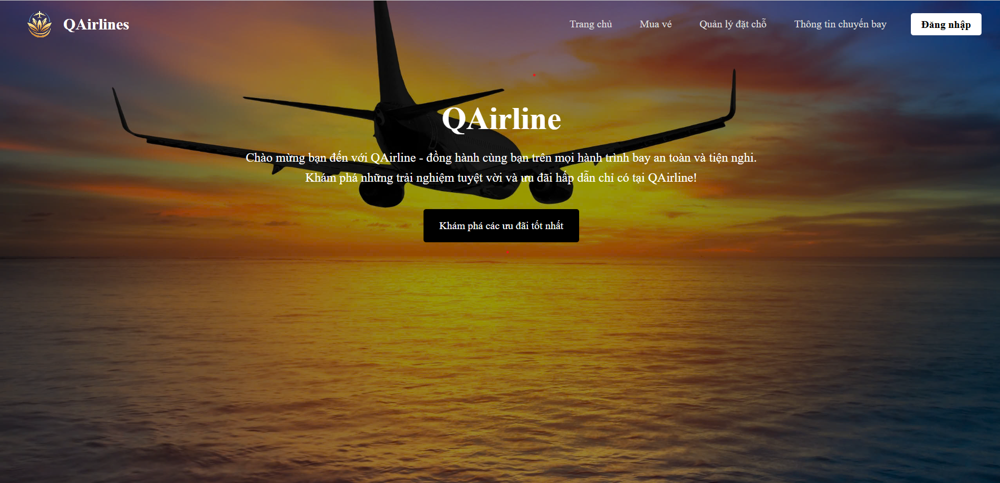
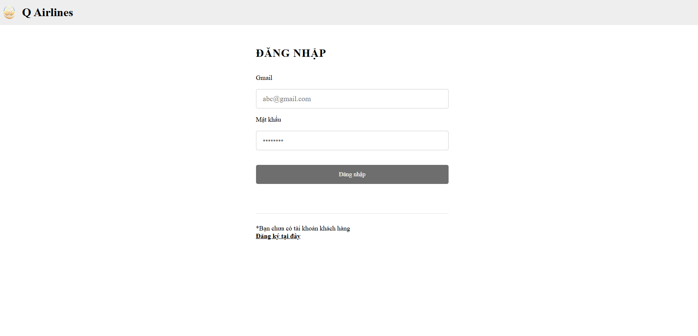
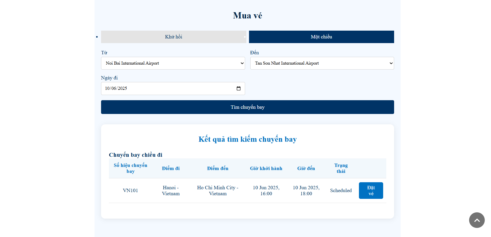
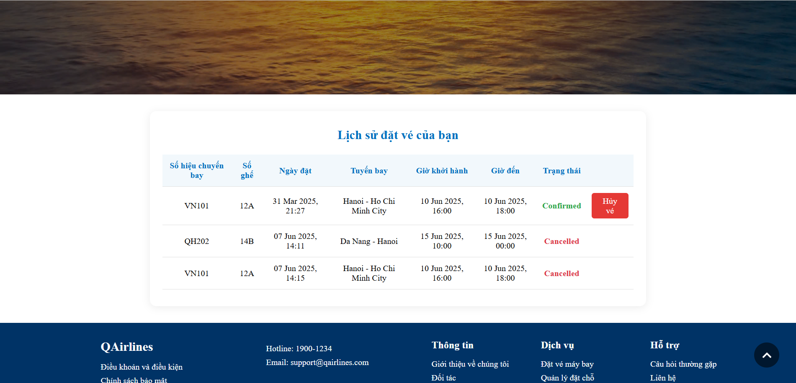
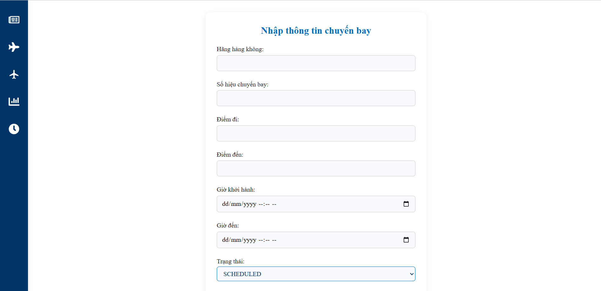

# QAirlines - Airline Booking

QAirlines là hệ thống đặt vé máy bay và quản lý hãng hàng không hiện đại, hỗ trợ cả khách hàng và quản trị viên.

---

## 🚀 Tính năng nổi bật

### Đối với khách hàng
- **Đăng ký, đăng nhập** tài khoản khách hàng.
- **Tìm kiếm, đặt vé máy bay** theo hành trình, ngày đi.
- **Quản lý vé đã đặt**: xem lịch sử, hủy vé trước giờ bay.
- **Xem thông tin chuyến bay**: tra cứu trạng thái, giờ đi/đến.
- **Xem tin tức, ưu đãi, thông báo** từ hãng.
- **Trang cá nhân**: xem thông tin cá nhân.

### Đối với quản trị viên/nhân viên
- **Đăng nhập hệ thống quản trị**.
- **Đăng tin tức, khuyến mại, thông báo** cho khách hàng.
- **Quản lý chuyến bay**: thêm, sửa, xóa chuyến bay.
- **Quản lý tàu bay**: thêm, sửa, xóa tàu bay.
- **Cập nhật giờ delay chuyến bay**.
- **Thống kê, báo cáo** (nếu có).

---

## ⚙️ Hướng dẫn cài đặt & chạy demo

### 1. Backend (Spring Boot)

- **Yêu cầu:** Java 8+, Maven, MySQL
- **Cài đặt:**
  1. Cấu hình `application.properties` với thông tin database.
  2. Build và chạy:
     ```bash
     cd spring-boot
     mvn clean install
     mvn spring-boot:run
     ```
     (Có thể chạy trên các IDE khác như Eclipse hay IntelliJ)
  3. API chạy tại: `http://localhost:8081/api/`

> 🔧 **Lưu ý:**  
> Dự án sử dụng hai cơ sở dữ liệu là `qairline` và `airline`:  
> - `qairline`: được sử dụng cho mục đích kiểm thử và quay video demo.  
> - `airline`: là cơ sở dữ liệu chính, đã được làm sạch và chuẩn hóa dữ liệu cho sản phẩm.  
> Bạn có thể tùy chỉnh database sử dụng bằng cách cập nhật:
> - File `application.properties` (Spring Boot)
> - Lớp `ConnectionUtil.java` trong `utils` (với JDBC)
> - Lớp `DatabaseConfig.java` trong `config` (nếu dùng cấu hình riêng)
> 
> Đừng quên điều chỉnh:
> ```properties
> spring.datasource.username=your_username
> spring.datasource.password=your_password
> spring.datasource.url=jdbc:mysql://localhost:3306/qairline
> ```
> Tùy theo database bạn muốn kết nối (`airline` hoặc `qairline`), hãy cập nhật tên database trong URL trên.

---

### 2. Frontend (ReactJS)

- **Yêu cầu:** NodeJS 16+, npm
- **Cài đặt:**
  1. Cài dependencies:
     ```bash
     cd frontend-react
     npm install
     ```
  2. Chạy ứng dụng:
     ```bash
     npm start
     ```
  3. Truy cập: [http://localhost:3000](http://localhost:3000)

---

## 💡 Công nghệ sử dụng

- **Frontend:** ReactJS, React Router, SCSS, React Icons, React Multi Carousel
- **Backend:** Spring Boot, Spring Security (JWT), JPA, MySQL

---

## 📷 Demo giao diện

### Trang chủ


### Đăng nhập


### Đặt vé máy bay


### Quản lý vé đã đặt


### Giao diện quản trị viên


---

## 📚 Tài liệu mở rộng

- Cấu hình router: `frontend-react/src/router/router-config.js`
- API backend: `spring-boot/src/main/java/com/airline/api/controller`

---

## 🧑‍💻 Nhóm thực hiện

- [Nguyễn Vũ Phương Đông - 21020817]
- [Trần Hoàng Anh - 21020802]
- [Đỗ Đình Trường - 21020858]

---

## 📄 License

This project is for academic and demonstration purposes only.
